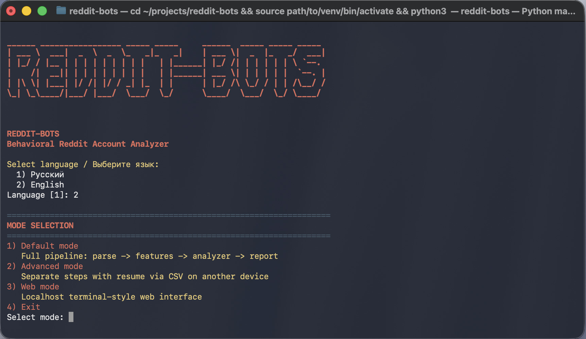

# REDDIT-BOTS

[English README](README.md) | [Русский README](README_RU.md)



`REDDIT-BOTS` is a compact Reddit account risk analyzer with:
- terminal CLI (`Default mode` and `Advanced mode`)
- local Web interface (`Web mode`)

It parses comments, builds account-level behavior features, and estimates suspiciousness (`bot_probability`).

## Project Tree

```text
reddit-bots/
├── main.py
├── main_parser.py
├── reddit_plots.py
├── reddit_bots/
│   ├── parser/
│   │   └── reddit_parser.py
│   ├── analysis/
│   │   ├── behavior_metrics.py
│   │   └── account_features.py
│   ├── models/
│   │   └── bot_classifier.py
│   ├── cli/
│   │   └── cli.py
│   └── web/
│       └── web_mode.py
├── requirements.txt
├── reddit_dead_internet_analysis_2026.csv
├── image1.jpg
├── README.md
└── README_RU.md
```

## Download

```bash
git clone https://github.com/ollxel/reddit-bots
cd reddit-bots
```

## Run

```bash
python3 -m venv .venv
source .venv/bin/activate
pip install -r requirements.txt
python3 main.py
```

## Web Interface

1. Start the app: `python3 main.py`
2. Select language.
3. Select `3) Web mode`.
4. Open `http://127.0.0.1:8080` (or custom host/port you entered).

The Web mode runs the same pipeline as default flow:
`parse -> account features -> analyzer -> suspicious accounts`.

For quick access to the tool, you can use alias:

```bash
alias reddit-bots="source ~/path/to/directory/reddit-bots/.venv/bin/activate && python3 ~/path/to/directory/reddit-bots/main.py"
```
