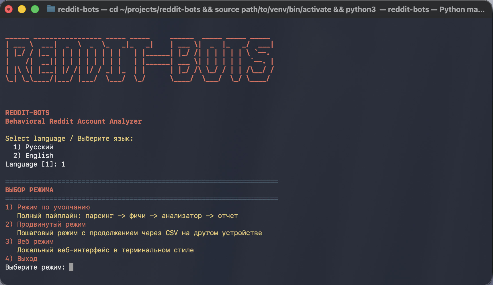

# REDDIT-BOTS

[English README](README.md) | [Русский README](README_RU.md)



`REDDIT-BOTS` — компактный анализатор риска Reddit-аккаунтов с:
- терминальным CLI (`Режим по умолчанию` и `Продвинутый режим`)
- локальным веб-интерфейсом (`Веб режим`)

Инструмент парсит комментарии, строит поведенческие признаки на уровне аккаунта и оценивает подозрительность (`bot_probability`).

## Дерево проекта

```text
reddit-bots/
├── main.py
├── main_parser.py
├── reddit_plots.py
├── reddit_bots/
│   ├── parser/
│   │   └── reddit_parser.py
│   ├── analysis/
│   │   ├── behavior_metrics.py
│   │   └── account_features.py
│   ├── models/
│   │   └── bot_classifier.py
│   ├── cli/
│   │   └── cli.py
│   └── web/
│       └── web_mode.py
├── requirements.txt
├── reddit_dead_internet_analysis_2026.csv
├── image1.jpg
├── README.md
└── README_RU.md
```

## Как скачать

```bash
git clone https://github.com/ollxel/reddit-bots
cd reddit-bots
```

## Как запустить

```bash
python3 -m venv .venv
source .venv/bin/activate
pip install -r requirements.txt
python3 main.py
```

## Веб-интерфейс

1. Запустите приложение: `python3 main.py`
2. Выберите язык.
3. Выберите `3) Веб режим`.
4. Откройте `http://127.0.0.1:8080` (или ваш host/port).

Веб-режим запускает тот же полный пайплайн:
`парсинг -> фичи аккаунтов -> анализатор -> подозрительные аккаунты`.

Для быстрого доступа к инструменту вы можете использовать alias:

```bash
alias reddit-bots="source ~/path/to/directory/reddit-bots/.venv/bin/activate && python3 ~/path/to/directory/reddit-bots/main.py"
```
